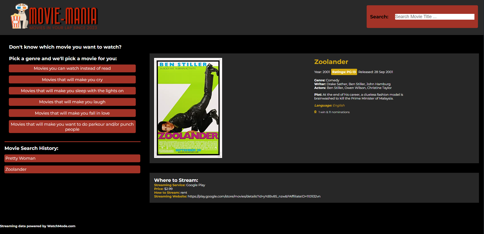

# Movie 

## Links

* Deployed Website: https://mia2380.github.io/Sneak-Attack-Project-1/

* Repo: https://github.com/mia2380/Sneak-Attack-Project-1

## Project Description/User Story: 

GIVEN a user wants to choose a movie to watch
WHEN a search for a film is executed on our site
THEN they are presented with a random film by genre and it's streaming availability

Our project  allows a user to pick a movie to watch by pulling data from two different API's. Users are first able to search for a movie by name. If they select a film it will pull general information, a poster, and the streaming location for the movie. The site will also save the search history of the user. If the user doesn't want know what to watch, they can choose from a number of random movie generators by genre.

## API's:
    OMDb
    WatchMode

## Screenshot 

