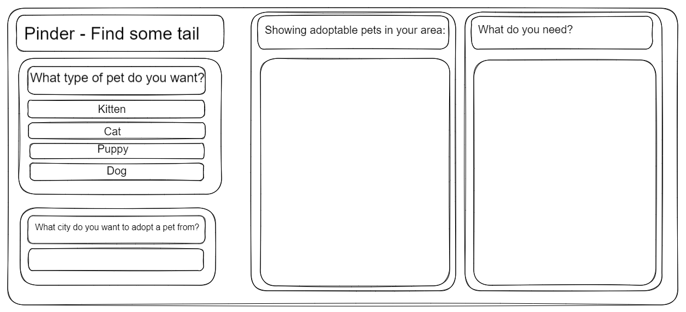

# Movie Mania

## Project Description/User Story: 

GIVEN a user wants to adopt a cat or dog
WHEN a searches for a pet on our site
THEN they are presented with a nearby adoption with an item to purchase for said animal

## API's:
    -Petfinder
    -Amazon

## Wire Frame

## To Do & Bug Fixes
* change alerts to modals
* Add local storage
* Price coming back as null - need to write a rule so it doesn't
* need to add the getStream() function to work with the movie search
* Need to format the results from the streaming (Erin will do once the APIs call again)
* Awards icons not showing (Brenda! Help!!!)
* Double check spelling for Romance and Action movies (rest have been done)
* update readme with new project info

## Task List

## HTML
    - choose what movies go into each category

## CSS
    -what font do we want to use?
    -whats our color scheme?
    -do we want to add pseudo codes for the links/hovering\
    - style the buttons

## JavaScript
    - choose what movies go into each category
    - add in some loops
    - and if statements
    - add in search parameter for location
    - implement Fetch API
    - and more magic

## APIs
    - call to API - see if you can get a response from it
    - see if you get CORS error
    - what errors do we get?
    - link api to amazon
    -link api to pet finder