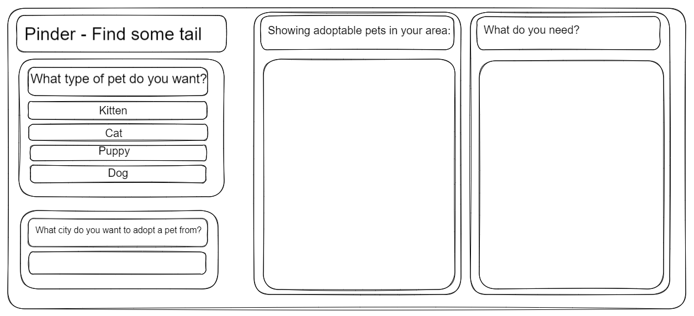

# Pinder - Find Some Tail

## Project Description/User Story: 

GIVEN a user wants to adopt a cat
WHEN a searches for a pet on our site
THEN they are presented with a nearby adoption with an item to purchase for said animal

## API's:
    -Petfinder
    -Amazon

## Wire Frame

## Task List

## HTML
    - header
    -nav bar?
    -side bar
    -body
    -footer
    - add div containers from the wire frame
    -name classes/ids
    -link CSS style sheet
    -link javascript sheet
    -add jquery links 
    -add api server links
    -choose which format to use for flexibility - flex box/grid/ect
    - do we want links to open in new browswer

## CSS
    -what font do we want to use?
    -whats our color scheme?
    -do we want to add pseudo codes for the links/hovering\
    - style the buttons

## JavaScript
    - click events for different type of pets
    - click events for amazon products
    - add in some loops
    - and if statements
    - add in search parameter for location
    - implement Fetch API
    - and more magic

## APIs
    - call to API - see if you can get a response from it
    - see if you get CORS error
    - what errors do we get?
    - link api to amazon
    -link api to pet finder